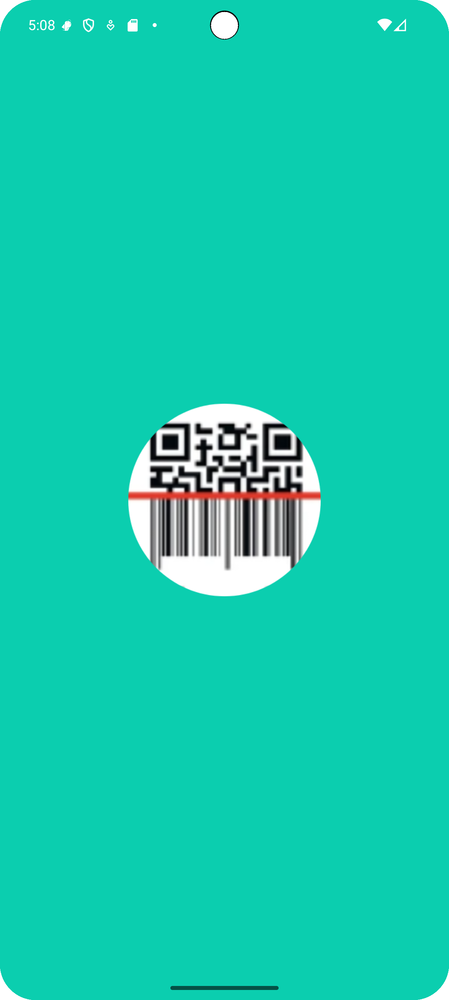
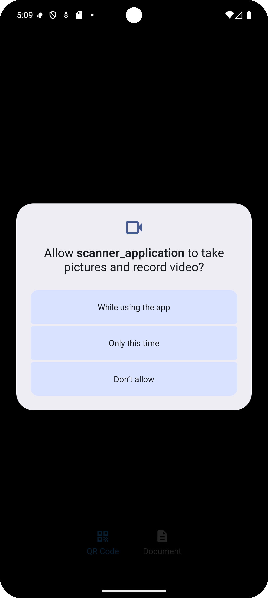
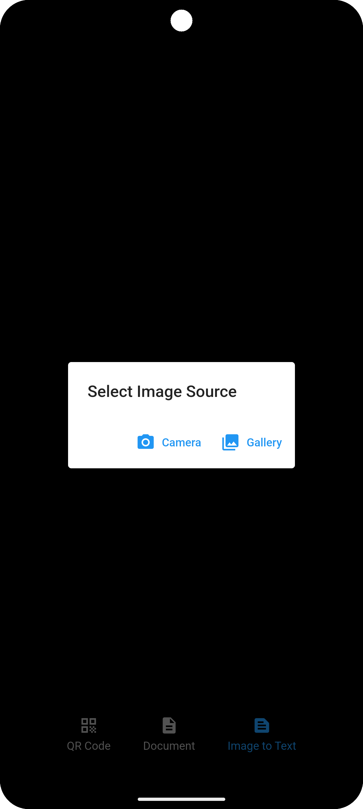
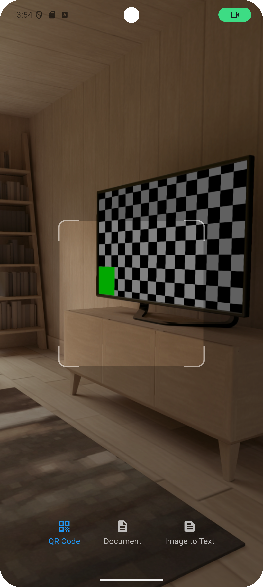

# Scanner Application

A professional Scanner Application built with Flutter. Scan documents, images, and QR codes easily from your device or gallery. The app is lightweight, fast, and user-friendly.

[Download the App](https://github.com/prothesbarai/scanner_application/tree/main/assets/apk_file)

---

## Features

- Scan documents directly from your camera
- Import images from gallery to scan
- Fast and accurate scanning
- Export scans as PDF or image
- Extrct text from image
- User-friendly interface
- Add ProGuard for Android : android/app/proguard-rules.pro
- Add buildTypes for Android :
```kotlin
buildTypes {
    getByName("release") {
        // Release build এ ProGuard enable করা হলো
        isMinifyEnabled = true
        isShrinkResources = true
        proguardFiles(
            getDefaultProguardFile("proguard-android-optimize.txt"),
            "proguard-rules.pro"
        )

        // আপাতত debug keys use হবে (নিজের keystore দিলে এখানে বসাতে হবে)
        signingConfig = signingConfigs.getByName("debug")
    }
}
```

---

## Screenshots

<p align="center">
  
  
  
  
</p>

---

## Installation

1. Clone the repository:
```bash
  git clone https://github.com/prothesbarai/scanner_application.git
```
